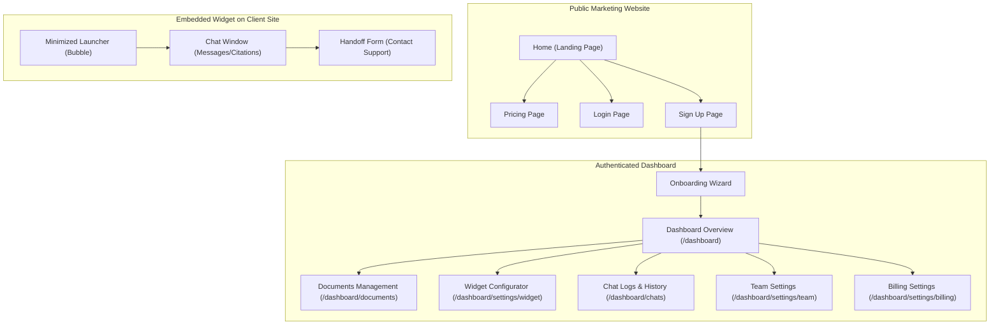

# AskMyDocs — Information Architecture & Sitemap

This document maps out the Information Architecture (IA) for AskMyDocs, detailing the pages, routing, layouts, and key UI components for the marketing site, user dashboard, and chat widget.

---

## 1. Information Architecture Overview

Here is the sitemap and primary user flow navigation structure for AskMyDocs:

---

## 2. Public Marketing Site (Unauthenticated)

These pages are accessible publicly and designed to educate visitors, present the product's benefits, and convert them to registered users.

### 2.1. Home Page (`/`)
* **Purpose:** Introduce the product, explain its core value proposition (turn documentation into an instant support agent), show how it works, and direct users to register.
* **Key UI Elements:**
  * **Navigation Bar:** Brand Logo, Features link, Pricing link, Log In button, "Get Started" (primary CTA).
  * **Hero Section:** High-impact heading, sub-headline, and double CTAs ("Start Free Trial", "Watch Demo").
  * **Interactive Demo Preview:** A live sandbox where visitors can ask questions to a mock bot to experience the widget responsiveness first-hand.
  * **How It Works (3-Step Flow):**
    1. Upload documents or paste website links.
    2. Test and customize the AI bot appearance/tone.
    3. Copy the ``).

### 3.5. Chat Logs & Analytics (`/dashboard/chats`)
* **Purpose:** Audit AI conversational quality, examine citations, and discover document coverage gaps.
* **Key UI Elements:**
  * **Left Panel (Chats List):** Search bar, date range filters, flag filters (All, Low-Confidence, Unanswered). List elements showing time, length, and rating (Thumbs Up/Down).
  * **Center Panel (Thread Transcript):**
    * Scrollable thread view showing conversation between Customer and Bot.
    * Citations/References highlighted inline (hovering shows exact document snippet).
    * Rating details (if customer left a note with thumbs-down).
    * Action bar: "Export Chat", "Convert to Support Ticket" (manually trigger email forwarding).

### 3.6. Team Settings (`/dashboard/settings/team`)
* **Purpose:** Manage administrative permissions inside the workspace.
* **Key UI Elements:**
  * **Add Team Member Form:** Email address input, role select dropdown (`Member`, `Admin`), "Send Invitation" action.
  * **Pending Invites List:** Displays email, invitation link, role, and "Revoke" button.
  * **Team Roster Table:** List of current members showing name, avatar, email, assigned role, and edit/delete permissions (restricted to Owner).

### 3.7. Billing Settings (`/dashboard/settings/billing`)
* **Purpose:** Manage active subscriptions and resource quota extensions.
* **Key UI Elements:**
  * **Plan Card:** Current plan name, cost, renewal date.
  * **Upgrade Section:** Displays tier options for fast upgrade checkout paths.
  * **Stripe Billing Portal Button:** Direct, secure link redirecting to the organization's Stripe invoices page to modify credit cards or cancel subscriptions.

---

## 4. Embeddable Chat Widget (Client-Facing)

The widget is loaded via an iframe or web component dynamically on the client's site. It must be highly performant, accessible, and responsive.

### 4.1. State 1: Minimized Launcher
* **Purpose:** Rest at the bottom-right of the site without obstructing content.
* **Key UI Elements:**
  * Icon button (Chat bubble, customizable avatar).
  * Hover tooltip (e.g., "Ask our docs!").
  * Pulse indicator / Unread badge.

### 4.2. State 2: Main Chat Window (Opened)
* **Purpose:** Serve as the conversation interface.
* **Key UI Elements:**
  * **Header:** Bot profile photo/avatar, Bot Name, custom subtitle (e.g., "AI Assistant"), Close (minimize) button.
  * **Conversational Feed:**
    * Messages grouped chronologically with automated scrolling.
    * Typing Indicator: Simple three-dot pulse animation when RAG pipeline is processing responses.
    * Suggested starter questions (Quick-reply pills for FAQs).
    * Markdown formatting support for tables, lists, and code blocks inside AI answers.
    * Hoverable citation numbers (e.g., `[1]`, `[2]`) that open popup bubbles with the exact excerpt source document title.
  * **Footer:**
    * Textarea field with "Press Enter to Send".
    * Send Button (Paper-airplane icon).
    * Whitelabel signature: Small "Powered by AskMyDocs" link (removed on Pro/Business tiers).

### 4.3. State 3: Handoff / Contact Support Form
* **Purpose:** Capture user details and query for human escalation when the AI hits a confidence threshold limit.
* **Key UI Elements:**
  * **Form Prompt Header:** "Our AI couldn't find the exact answer. Let us forward this to our support team."
  * **Input Fields:** User Name, User Email, Message (pre-populated with original query).
  * **Submit Button:** Send to organization inbox.
  * **Success Message:** "Thank you! Our support team has received your query and will contact you at your email shortly."
